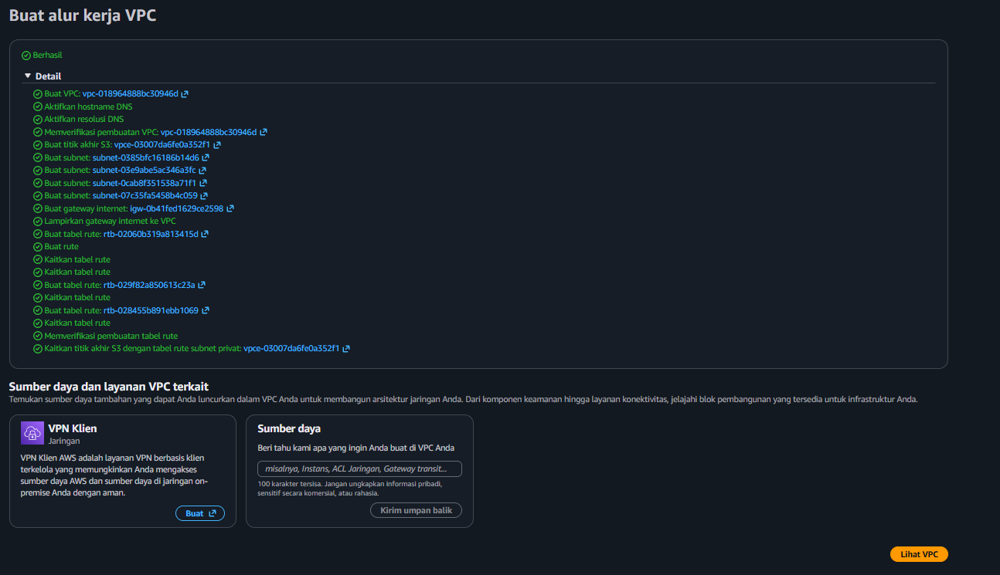
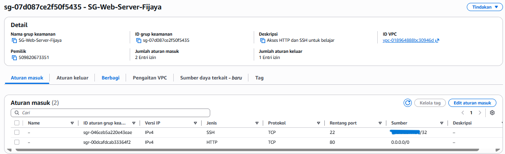
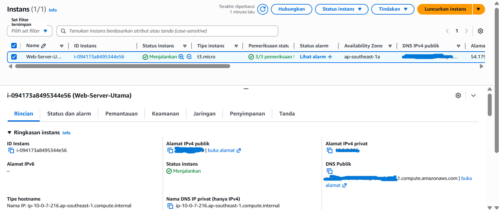
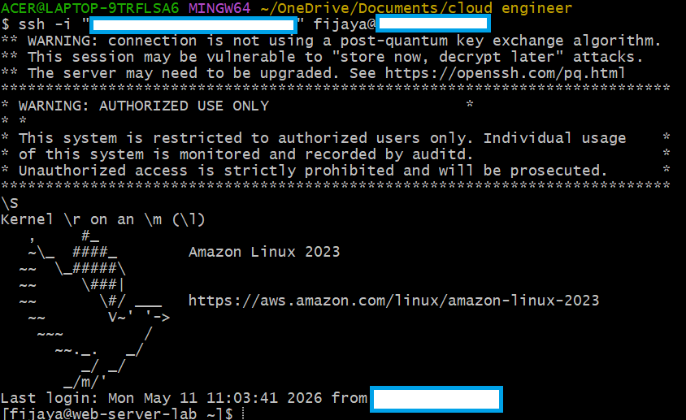
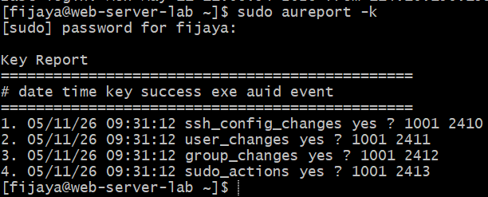
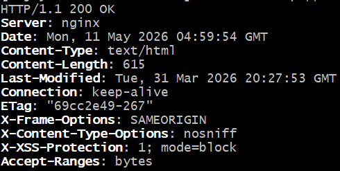
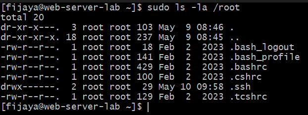
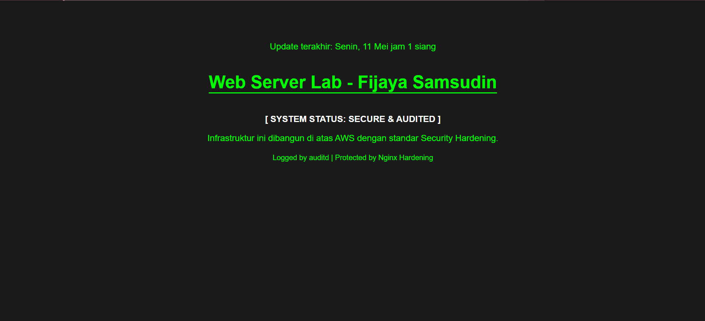
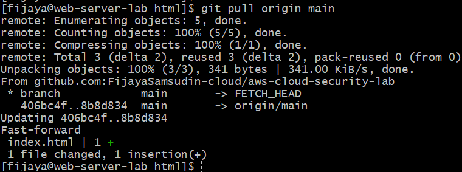

# aws-cloud-security-lab
Repository ini berisi jurnal belajar, konfigurasi infrastruktur, dan implementasi keamanan di AWS.

# Cloud Security Learning Lab

Halo! Saya **Fijaya Samsudin**. Repository ini adalah bukti perjalanan saya mendalami:
* **AWS Cloud Infrastructure**
* **Cloud Security Engineering**
* **DevOps & Automation**

## Progress Saat Ini:
- [x] Setup GitHub & Git Local (Completed)
- [x] Configure AWS VPC & Networking (Completed)
- [x] Security Group & Firewall Hardening (Completed)
- [x] Deploy EC2 Instance (Amazon Linux 2023) (Completed)
- [x] Advanced System Hardening & User Management (Completed)
- [x] System Auditing & Legal Compliance (Completed)
- [x] Web Server Deployment & Nginx Hardening (Completed)
- [x] CI/CD Workflow: Local-GitHub-AWS Integration (Completed)
- [ ] SSL/HTTPS Encryption (Next Step)

### 08 Mei 2026: Identity and Access Management (IAM) & Security
- [x] Mengecek Billing Dashboard (Memastikan Free Tier aktif).
- [x] Mendapatkan AWS Credits sebesar US$119.97 (Valid until Nov 2026).
- [x] Membuat IAM User Admin untuk menghindari penggunaan Root Account (Best Practice).
- [x] Berhasil login menggunakan user `fijaya-admin` dengan akses Administrator.
- [x] Mengaktifkan MFA (Multi-Factor Authentication) untuk keamanan ekstra pada akun Admin.
### 08 Mei 2026: Networking (VPC) - COMPLETED
- [x] **VPC Deployment**: Berhasil membangun VPC khusus (`proyek-vpc`) menggunakan wizard "VPC and more" untuk memastikan konfigurasi yang rapi.
- [x] **Multi-AZ Architecture**: Menggunakan 2 Availability Zones untuk standar High Availability (Ketersediaan Tinggi).
- [x] **Tiered Subnets**: 
    - 2 Public Subnets (untuk resource yang butuh akses internet langsung).
    - 2 Private Subnets (untuk resource internal/database agar lebih aman).
- [x] **Cost Optimization**: Memilih untuk tidak menggunakan NAT Gateway guna menghemat biaya operasional selama fase belajar.
- [x] **Security Enhancement**: Mengaktifkan **S3 Gateway Endpoint**, memungkinkan akses ke layanan S3 secara privat tanpa melalui internet publik.

### 09 Mei 2026: Security Hardening & Firewall Infrastructure
- [x] **Git Identity Fix**: Berhasil mengonfigurasi identitas Git global agar kontribusi tercatat dengan benar.
- [x] **Security Group (Stateful Firewall)**: Membuat `SG-Web-Server-Fijaya` di dalam `proyek-vpc`.
- [x] **Inbound Rules Hardening**: 
    - Membatasi akses port 22 (SSH) hanya dari IP publik pribadi (Admin Only).
    - Membuka port 80 (HTTP) untuk lalu lintas web publik.
- [x] **Outbound Rules Verification**: Memastikan server memiliki akses keluar penuh (default) untuk update sistem.

### 10 Mei 2026: Compute Provisioning & System Hardening
- [x] **EC2 Instance Launch**: Berhasil mendeploy server menggunakan Amazon Linux 2023 (t3.micro).
- [x] **System Identity**: Mengubah hostname menjadi `web-server-lab`.
- [x] **Timezone Synchronization**: Mengatur timezone ke `Asia/Jakarta` (WIB) untuk akurasi log.
- [x] **Security Update**: Menjalankan `dnf update` untuk patch keamanan terbaru.

### 11 Mei 2026: Advanced System Hardening & Web Deployment 🛡️

Pada tahap ini, fokus utama adalah memperkuat pertahanan internal server (*Internal Hardening*) dan melakukan deployment Web Server dengan standar keamanan tinggi.

#### **I. Identity, Monitoring & Compliance**
- [x] **User & Privilege**: Migrasi dari `ec2-user` ke user personal `fijaya` dengan hak akses `sudo` terbatas via grup `wheel`.
- [x] **SSH Hardening**: Implementasi SSH Key Authentication dan pengaturan permission ketat pada folder `.ssh` (700).
- [x] **System Auditing**: Aktivasi `auditd` (CCTV Digital) untuk merekam setiap aktivitas administratif sensitif.
- [x] **Legal Banner**: Pemasangan banner peringatan hukum pada akses login SSH via `/etc/issue.net`.

| SSH Login Banner | Audit Log Verification |
| :---: | :---: |
|  |  |

#### **II. Nginx Web Server Hardening**
- [x] **Minimal Installation**: Deployment Nginx pada Amazon Linux 2023.
- [x] **Information Masking**: Mengaktifkan `server_tokens off` untuk menyembunyikan identitas versi server.
- [x] **DDoS Mitigation**: Optimasi buffer size dan timeout untuk membatasi konsumsi sumber daya berlebih.
- [x] **Security Headers**: Implementasi `X-Frame-Options`, `X-XSS-Protection`, dan `X-Content-Type-Options`.

| Nginx Security Headers | User Account Success |
| :---: | :---: |
|  |  |

#### **III. DevOps Workflow & Automation**
- [x] **Git Integration**: Mengonfigurasi Git pada server Amazon Linux 2023 untuk sinkronisasi kode secara remote.
- [x] **SSH Key Authentication (Server-to-GitHub)**: Mendeploy SSH Key (Ed25519) pada server untuk akses aman ke repository GitHub tanpa password.
- [x] **Automated Deployment Workflow**: Mengimplementasikan alur kerja "Local-to-Cloud-to-Server". Perubahan kode dilakukan di VS Code (Laptop), di-push ke GitHub, dan ditarik (*pull*) secara instan ke server produksi.
- [x] **Ownership Hardening**: Mengatur ulang hak akses direktori `/usr/share/nginx/html` ke user `fijaya` guna mendukung otomatisasi Git tanpa memerlukan akses root yang berisiko.

| Custom Landing Page (Live) | Git Pull Automation |
| :---: | :---: |
|  |  |